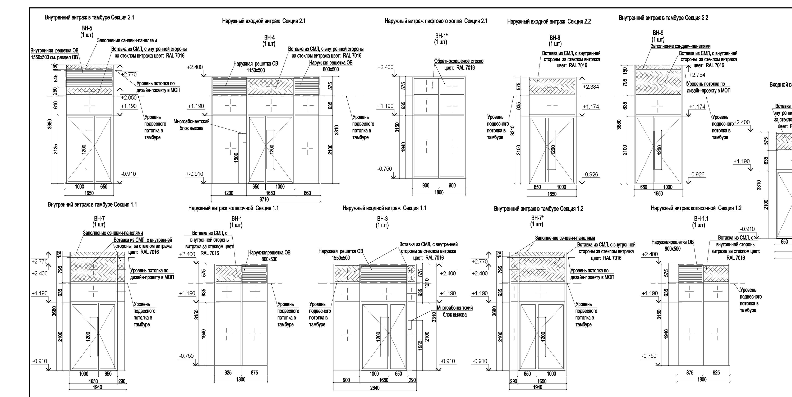

# Сервис для анализа проектной документации по витражным конструкциям

**Описание** 

Сервис автоматизирует анализ проектной документации (ПД) для витражных конструкций. После загрузки PDF-файла и ввода необходимых для анализа страниц система извлекает ключевые параметры: наименование (позицию) и габаритные размеры. Это позволяет инженерам и проектировщикам отказаться от ручного переноса данных, тем самым сэкономить время и исключить ошибки ввода. Результат работы сервиса — структурированная информация, готовая для интеграции в спецификации. Таким образом, решение значительно ускоряет обработку ПД и повышает надежность исходных данных для производства.  

**Бизнес-цель**

Ускорение анализа проектной документации по витражным конструкциям и исключение ошибок при ручном переносе данных.

**Аналоги**

Существуют OCR-решения, направленные на анализ чертежей. Однако сервисов полностью решающих поставленные задачи не найдено. 

К возможным решениям также относится использование больших LLM, таких как ChatGPT, DeepSeek и т.п. Однако такой подход имеет ряд недостатков, а именно:
1)	Отсутствие ведения базы данных: можно получить готовый результат, однако далее необходимо копирование данных в нужное место (то есть в конкретную директорию)
2)	Ошибки в определении габаритных размеров

**1.1 Текущая ситуация (Assessing current solution)**

Оценка ресурсов для проекта.

•	Доступное железо: ноутбук (CPU) с оперативной памятью 8 ГБ

•	Хранение данных:
данные хранятся на локальном ПК (в данный момент не на том ПК, на котором планируется разработка сервиса). Доступ к данным будет предоставлен со стороны заказчика. При этом заказчик не предоставляет полностью готовый набор данных. Необходимо провести их систематизацию, то есть сбор в единое хранилище. 

•	Наличие экспертов со стороны заказчика: со стороны заказчика будет эксперт, который будет отвечать на вопросы, связанные с конечным результатом, а также на другие вопросы, не связанные с разработкой.

Типичные риски 

1) Наличие вероятности не уложиться в сроки по причине полного отсутствия опыта ведения проектов, связанных с LLM, их дообучением

   Для преодоления риска будет написан план проекта, которому необходимо чётко соответствовать. Планируется посещение консультаций с экспертами для преодоления возникающих трудностей.

2) Потенциально малое количество данных (исходных чертежей) для обучения модели

   Довольно сложно провести оценку данного риска ввиду небольшого опыта. Однако если придётся столкнуться с этим риском возможны два решения: увеличение количества данных путём их ручного поиска в хранилище, доступ к которому предоставит заказчик или синтетическое создание данных.

3) Нехватка ресурсов по железу

Для преодоления рассматривается использование облачных ресурсов для обучения моделей.

**1.2 Решаемые задачи с точки зрения аналитики (Data Mining goals)**
   
Постановка задачи в технических терминах

•	Метрики – precision (достоверность извлечённых данных), recall (полнота охвата характеристик), accuracy (доля верно извлечённых данных). Возможно использование F1-меры для совместной оценки precision/recall. 

Оценка будет производитьcя как по трём  позициям отдельно( наименование, габаритные размеры - длина, ширина), так и по всем позициям вместе.

•	Критерий успешности пока сложно оценить, хотелось бы иметь максимальные значения. Для F1-score > 0,95.

•	Дополнительная оценка будет производиться людьми, которые на текущий момент производят эту операцию вручную

**1.3 План проекта (Project Plan)**

| Этап | Название | Описание | Даты |
|:---|:---|:---|:---|
| 1 | Бизнес-анализ | • определение цели проекта  • оценка текущей ситуации  • определение метрик  • составление плана | 01.06 - 07.06 |
| 2 | Анализ и подготовка данных | • создание хранилища данных  | 08.06 - 14.06 |
| 3 | Моделирование | • выбор модели машинного обучения  • дообучение модели | 15.06 - 30.06 |
| 4 | Оценка решения | • оценка качества работы модели по определённым на этапе 1 метрикам | 01.07 - 07.07 |
| 5 | Внедрение | • интеграция обученной модели в рабочий процесс заказчика | 08.07 - 15.07 |
| 6 | Тестирование и мониторинг | • проверить работу сервиса в реальных условиях | 16.07 - 23.07 |

Пример чертежа для анализа. В данном случае анализу подлежат 11 чертежей (самый правый обрезан). 

